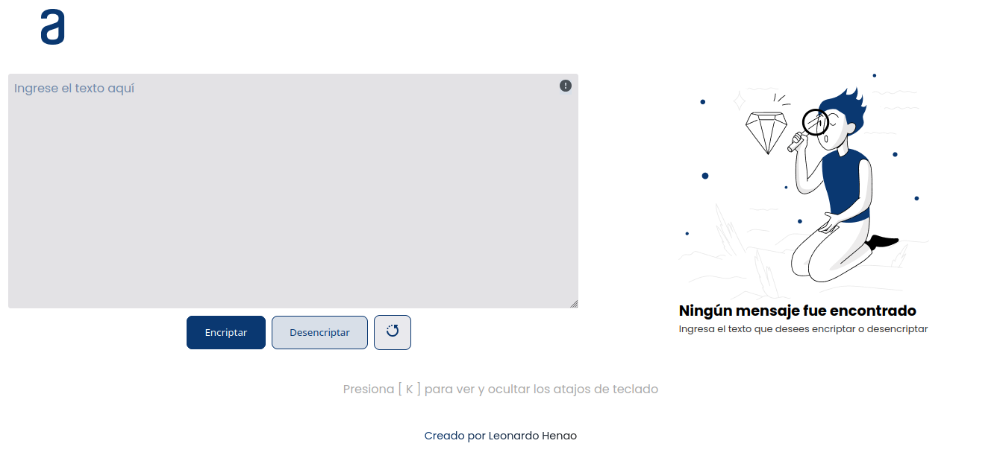

# Challenge Alura + Oracle

Challenge de encriptador y desencriptador creado por [Leonardo Henao](https://leonardohenao.com)

## Instalación

- Clone el repositorio de la rama `main`
- Ejecute el servidor de confianza para abrir el proyecto en su navegador
  - `Live server` si utiliza [Visual Studio Code](https://code.visualstudio.com/)
  - `Light server` para ser ejecutado desde consola, recuerde instalar el paquete de npm [light server](https://www.npmjs.com/package/light-server)

## Instrucciones

Al escribir un texto y tocar al boton **Encriptar** el sistema sustituira cada letra(llave) por el valor de la llave correspondiente. _[Vea llaves de encriptacion y desencriptacion](/#llaves-de-encriptacion-y-desencriptacion)_

Ejemplo:
`"gato" => "gaitober"`

Al escribir un texto y tocar al boton **Desencriptar** el sistema sustituira cada valor encontrado en el texto por la llave correspondiente.

Ejemplo:
`gaitober" => "gato"`

## Llaves de encriptacion y desencriptacion

| llave | valor |
| ----- | ----- |
| a     | ai    |
| e     | enter |
| i     | imes  |
| o     | ober  |
| u     | ufat  |

## Accesibilidad

Para efectos de accesibilidad, el proyecto fue diseñado con los siguientes atajos de teclado:

| Botón  | Function                                                              |
| ------ | --------------------------------------------------------------------- |
| Escape | - Cerrar tooltips de información\*  - Salir de la entrada de texto |
| K      | Abrir o cerrar tooltips de información\*                              |
| E      | Encriptar texto\*                                                     |
| D      | Desencriptar texto\*                                                  |
| R      | Limpiar entrada de texto\*                                            |
| C      | Copiar texto convertido (Encriptado/Desencritado)\*                   |

\*_Funciones disponibles cuando esta fuera de la entrada de texto_
